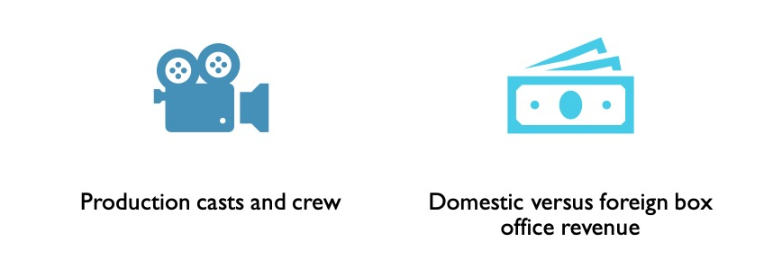
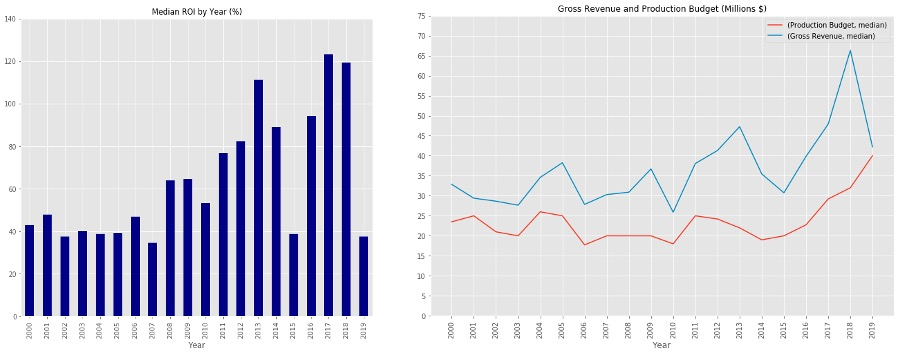
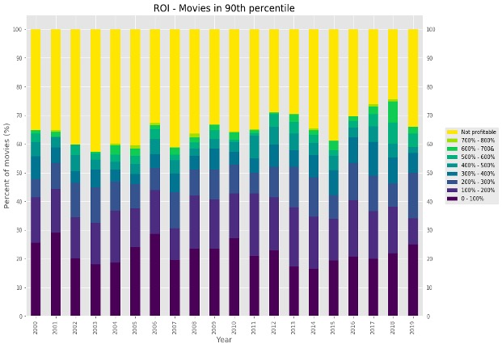
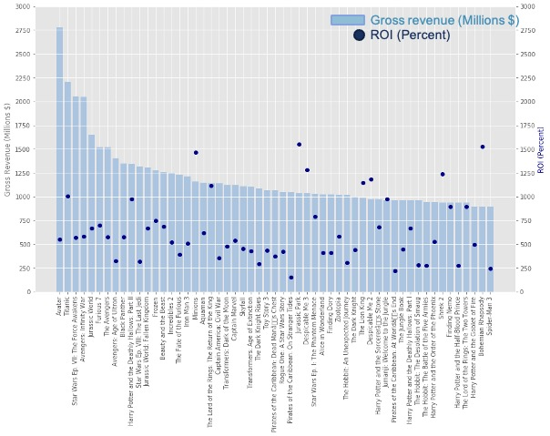
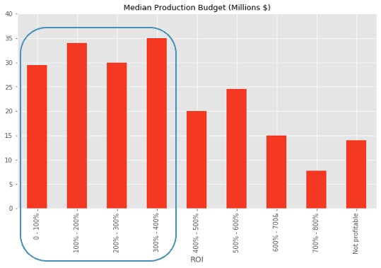

# Module 1 Final Project

**Author**: [Magali Solimano](mailto:magali.solimano@gmail.com)

**Date**: June 1, 2021

## Overview

The Module 1 project examines the movie industry for a client that is interested in entering the business. Descriptive data analysis of gross revenue, production costs, return on investment, run times, popular genres, and seasonality shows that the movie industry is profitable, but there is large variation in performance across films and production studios. The client can use this analysis to understand the key trends in the movie industry, identify its main competitors, and determine the types of films they will be creating. This analysis also serves as a baseline for deeper dives on the movie industry.

## Business Problem 
The client wants to create a new movie studio and, as a potentially new entrant, is seeking information about the movie industry to inform its business decisions. 

## Data

This project explored 11 large, movie-related data sets from four sources: Box Office Mojo, IMDB, Rotten Tomatoes, TheMovieDB.org. The data files provide a wide range of information since atleast the year 2001 about individual movies' box office revenue, budgets, genres, as well as production studios and associated casts and crew members. Several data files contain information that complements the others, while other data was repetitive. 

## Methods

This project applies exploratory data analysis and examines trends of key metrics over time. This provides an insightful overview of the evolution of the performance of the movie industry.

## Results
The movie industry is a profitable, but challenging business. Forty percent of movies generate healthy return on investment exceeding 100%, while the other films generate thinner returns or are not profitable.

Top grossing movies are profitable. But, the top grossing movies do not necessarily have the highest ROI.

Cost control is important, but studios must typically spend a minimum of $30M-$35M to produce a movie with up to 400% ROI. Unprofitable films have lower production budgets.

## Conclusions
Movie industry profitability has increased over the last decade, but there are large outliers and only 75% of films are profitable. Blockbuster box office performance does not necessariy equate to higher return on investment. Six studios dominate the film industry and would be direct competitors.

## Next Steps
Further analysis should examine the breakdown between domestic and international revenue generation, as well as the outcomes of production crew and casts.

## More information
See the full analysis in the [Jupyter Notebook](./Project1Submission_MagaliSolimano_6_1_2021.ipynb) or review this [presentation](./presentation.pdf).
For additional information, please contact Magali Solimano at [magali.solimano@gmail.com](mailto:magali.solimano@gmail.com)
